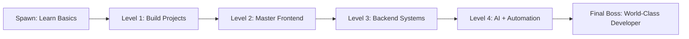

<div align="center">

<!-- 3D Neon Header -->


<!-- Typing Animation -->


<br><br>

<!-- Gamer Badges -->


<br><br>


</div>

---

<div align="center">


</div>

---

<div align="center">

## ⚔️ Player Profile

</div>

<table>
<tr>
<td width="55%">

```yaml
name: "YOUR NAME"
username: "YOUR_USERNAME"
role: "Developer | Gamer | Builder"
location: "Earth Server"
current_mission: "Building next-level projects"
power_level: "Over 9000"
status: "Always learning. Always building."
favorite_stack:
  - JavaScript
  - TypeScript
  - Python
  - React
  - Node.js
  - AI Tools
  - Game Development
```

</td>
<td width="45%" align="center">


</td>
</tr>
</table>

---

<div align="center">

## 🎮 Developer Command Center

<table>
<tr>
<td align="center" width="25%">

<br><b>Focus</b>
</td>
<td align="center" width="25%">

<br><b>Creativity</b>
</td>
<td align="center" width="25%">

<br><b>Problem Solving</b>
</td>
<td align="center" width="25%">

<br><b>Debugging</b>
</td>
</tr>
</table>

</div>

---

<div align="center">

## 🕹️ Tech Loadout


<br><br>


</div>

---

<div align="center">

## 🧠 Skill Radar

<table>
<tr>
<td width="50%" align="center">

### ⚔️ Combat Skills


</td>
<td width="50%" align="center">

### 🔥 Power Levels


</td>
</tr>
</table>

</div>

---

<div align="center">

## 🧬 3D Power Stats


<br><br>


</div>

---

<div align="center">

## ⚡ Contribution Battle Map


</div>

---

<div align="center">

## 🐍 Contribution Snake Arena

<picture>
  <source
    media="(prefers-color-scheme: dark)"
    srcset="https://raw.githubusercontent.com/YOUR_USERNAME/YOUR_USERNAME/output/github-contribution-grid-snake-dark.svg"
  />
  <source
    media="(prefers-color-scheme: light)"
    srcset="https://raw.githubusercontent.com/YOUR_USERNAME/YOUR_USERNAME/output/github-contribution-grid-snake.svg"
  />
  
</picture>

</div>

---

<div align="center">

## 🏆 3D Trophy Wall


<br><br>


<br><br>


</div>

---

<div align="center">

## 🎒 Developer Inventory

<table>
<tr>
<td align="center" width="20%">

<br><b>Code Sword</b>
</td>
<td align="center" width="20%">

<br><b>Repo Shield</b>
</td>
<td align="center" width="20%">

<br><b>React Orb</b>
</td>
<td align="center" width="20%">

<br><b>Python Spell</b>
</td>
<td align="center" width="20%">

<br><b>Data Crystal</b>
</td>
</tr>
</table>

</div>

---

<div align="center">

## 🚀 Featured Projects

<table>
<tr>
<td width="50%" align="center">

### 🎮 Project One


</td>
<td width="50%" align="center">

### 🧠 Project Two


</td>
</tr>
</table>

</div>

---

<div align="center">

## 🧩 Boss Battle Roadmap



</div>

---

<div align="center">

## 🌐 Connect With Me

<a href="https://github.com/YOUR_USERNAME">
  
</a>
<a href="https://linkedin.com/in/YOUR_LINKEDIN">
  
</a>
<a href="https://twitter.com/YOUR_TWITTER">
  
</a>
<a href="mailto:YOUR_EMAIL">
  
</a>

</div>

---

<div align="center">


<br>


</div>
